<a id="top"></a>

<div align="center">

# 🎬 Auto News Video

### Turn any Vietnamese article or GitHub repo URL into a 9:16 TikTok/Reels/Shorts video

**One command. Zero editing. Studio-quality 9:16 motion graphics.**

[](https://github.com/ptit9x/auto-generate-short-videos/stargazers)
[](https://github.com/ptit9x/auto-generate-short-videos/network/members)
[](LICENSE)
[](https://nodejs.org)
[](https://www.typescriptlang.org/)

[**🇬🇧 English**](README.en.md) · [**🇻🇳 Tiếng Việt**](README.md) · [**📖 Full Docs (VN)**](README.full.md) · [**📺 Watch Demo**](https://youtube.com/shorts/LIRlnWArqaM) · [**🚀 Quick Start**](#-quick-start) · [**❓ FAQ**](#-faq)

</div>

---

<div align="center">

## 🎥 Live Demo

| 🍔 Bun v1.4.1 | 🖥️ OpenScreen |
|-------------------|---------------------|
| [](https://youtube.com/shorts/LIRlnWArqaM) | [](https://youtube.com/shorts/5noesbFXK0k) |
| [Watch on YouTube](https://youtube.com/shorts/LIRlnWArqaM) | [Watch on YouTube](https://youtube.com/shorts/5noesbFXK0k) |

### 🎙️ Watch on Facebook Reels and TikTok

[Watch on Facebook](https://www.facebook.com/reel/2549425188850979)

*This video was generated **entirely** by this pipeline — Vietnamese TTS + HyperFrames + GSAP animations, no manual editing.*

</div>

---

## 🤔 Why does this exist?

Creating short-form news videos is **time-consuming and repetitive**:

- ⏰ Manually scripting → 30 min per video
- 🎨 Picking visuals + animations → 1 hour per video
- 🎙️ Recording or sourcing voiceover → 30 min
- ✂️ Editing in CapCut / Premiere → 1 hour
- 📱 **Total: ~3 hours per 60-second video**

**Auto News Video does it in 5 minutes. Just paste a URL.**

| | Manual workflow | Auto News Video |
|---|---|---|
| ⏱️ Time per video | ~3 hours | **~5 minutes** |
| 🎓 Skill required | Video editor | **None** |
| 🎯 Consistency | Varies | **Studio-grade every time** |
| 💰 Cost per video | $50–200 (freelancer) | **$0 (Edge TTS Free) / AI Agent** |
| 🇻🇳 Vietnamese voice | Time-consuming | **Edge TTS (Free) / Vbee / LucyLab / ElevenLabs** |

---

## 🚀 Quick Start

```bash
# 1. Clone & install
git clone https://github.com/ptit9x/auto-generate-short-videos.git
cd auto-video-gen
npm install

# 2. Configure environment (works out of the box with 100% Free Edge TTS)
cp .env.example .env
```

Then choose one of the paths:

**Path A — Antigravity IDE (Recommended):**

1. Open the project folder in **Antigravity IDE**.
2. In the chat box, type:
   ```
   /create-news-video https://github.com/zabbix/zabbix
   ```
   *(or provide any news article URL or .txt file)*. Antigravity will automatically fetch content, write the motion script, generate Free Edge TTS audio, and render the complete MP4 video.

**Path B — Claude Code in terminal / VS Code:**

1. Install Claude Code: `npm install -g @anthropic-ai/claude-code`
2. Run `claude` in your terminal (or open the Claude Code panel in VS Code), then type:
   ```
   /create-news-video https://github.com/zabbix/zabbix
   ```

**Path C — Without AI Coding Agent (hand-write the script):**

```bash
# Edit script.json manually based on src/render/script-schema.ts
npm run pipeline -- output/my-video/script.json
```

After ~3–5 minutes you'll have `output/<slug>/video.mp4` — a 1080×1920 MP4 ready for TikTok / Shorts / Reels — plus `subtitles.srt` (timeline-accurate, drop it straight into YouTube/Shorts) and article photos/videos auto-downloaded into `media/` for illustration.

> 💡 **Need details?** Jump to [Full Setup](#-full-setup) · [Configuration](#-configuration) · [Usage](#-usage)

---

## ✨ Features

<table>
<tr>
<td width="33%" align="center">
<h3>🎨 7 Smart Templates</h3>
<sub>hook · comparison · stat-hero · feature-list · callout · media-strip · outro</sub>
</td>
<td width="33%" align="center">
<h3>🎤 Multi-TTS Engine</h3>
<sub><b>Edge TTS (100% Free, no API key, free SRT)</b>, LucyLab, ElevenLabs, or Vbee</sub>
</td>
<td width="33%" align="center">
<h3>🤖 AI Agent Skills</h3>
<sub>Supports both <b>Antigravity IDE</b> & <b>Claude Code</b>:<br/><code>/create-news-video &lt;url&gt;</code></sub>
</td>
</tr>
<tr>
<td width="33%" align="center">
<h3>🎬 2 Visual Themes</h3>
<sub>Studio shell + grain texture + GSAP animations, pick <code>dark-neon</code> (default) or <code>light-pro</code> via <code>VIDEO_THEME</code></sub>
</td>
<td width="33%" align="center">
<h3>🔊 Auto SFX Mixing</h3>
<sub>3-tier smart picker: manual override → semantic keyword match → template default</sub>
</td>
<td width="33%" align="center">
<h3>🧪 Production Ready</h3>
<sub>60 unit tests, Zod schema validation, full TypeScript ESM</sub>
</td>
</tr>
<tr>
<td width="33%" align="center">
<h3>📱 9:16 Native</h3>
<sub>1080×1920 @ 30fps, ready for TikTok / Shorts / Reels</sub>
</td>
<td width="33%" align="center">
<h3>♻️ Idempotent TTS</h3>
<sub>Skips re-synthesis if voice files exist — saves time and API quota across re-renders</sub>
</td>
<td width="33%" align="center">
<h3>📝 CapCut + TikTok Ready</h3>
<sub>Exports <code>script.txt</code> + <code>voice.mp3</code> for CapCut, plus auto-generated <code>caption.txt</code> (caption + 4 hashtags) for TikTok upload</sub>
</td>
</tr>
</table>

---

## 🆕 What's new in this update

- **🆓 Free Edge TTS Integration (`edge-tts-universal`)** — high-quality speech synthesis via Microsoft Edge TTS with **zero cost**, no account or API keys required, and automatic word-level SRT subtitle generation. Configured as the default provider (`TTS_PROVIDER=edge-tts`).
- **🪐 Antigravity Workspace Skill (`.agents/skills/create-news-video`)** — native workspace skill support for **Google Antigravity IDE**, enabling automated one-click video creation with `/create-news-video <url>`.
- **🎙️ Vbee TTS provider** — TTS option (`TTS_PROVIDER=vbee`) alongside LucyLab and ElevenLabs, for a Vietnamese async-polling voice API. See [Configuration](#️-configuration).
- **🎨 `light-pro` visual theme** — a white/slate/indigo, clean-corporate alternative to the original dark-neon look, selected via `VIDEO_THEME=light-pro`. Handy for running more than one channel/brand with distinct visual identities. See [`styles.light-pro.css`](src/render/templates/styles.light-pro.css).
- **📝 Auto TikTok caption + hashtags** — after every successful render, the skill now also writes `caption.txt`: a short punchy Vietnamese caption plus exactly 4 relevant hashtags, ready to paste straight into the TikTok upload screen.

---

## 🧠 How It Works

```mermaid
flowchart LR
    A[📰 URL / .txt / .md] -->|/create-news-video| B[Antigravity / Claude Code]
    B -->|fetch + analyze| C[Generate script.json]
    C -->|Zod validate| D{Template Picker}
    D -->|6 templates| E[Scene Types]
    E -->|TTS per scene| F[Edge TTS / Vbee / LucyLab / ElevenLabs]
    F -->|voice.mp3<br/>+ SFX mix| G[HyperFrames]
    G -->|Puppeteer + GSAP| H[Frames @ 30fps]
    H -->|FFmpeg encode| I[🎬 video.mp4 1080×1920]

    style A fill:#0f172a,color:#fff
    style I fill:#10b981,color:#fff
    style B fill:#6366f1,color:#fff
    style F fill:#f59e0b,color:#fff
    style G fill:#ec4899,color:#fff
```



The pipeline clearly separates concerns: **AI handles creativity** (Antigravity/Claude writes the motion script) and **deterministic code handles production** (Node/TS/FFmpeg renders pixel-perfect frames) — identical input yields identical output every time.

---

## 🛠️ Tech Stack

| Layer | Technology |
|---|---|
| **Runtime** | Node.js ≥ 22, TypeScript 6+, ESM |
| **Render engine** | [HyperFrames](https://hyperframes.heygen.com) ^0.4.34 (Puppeteer + GSAP + FFmpeg) |
| **TTS providers** | **Edge TTS** (`edge-tts-universal`, Free / No API Key) · [Vbee](https://vbee.vn) · [LucyLab.io](https://lucylab.io) · [ElevenLabs](https://elevenlabs.io) |
| **Schema validation** | [Zod](https://zod.dev) ^4 discriminated unions (6 template variants) |
| **HTTP** | axios ^1.15 + nock (test mocking) |
| **Concurrency** | [p-limit](https://github.com/sindresorhus/p-limit) ^7 (rate-limit TTS per provider) |
| **Testing** | [Vitest](https://vitest.dev) ^4 — ESM-native |
| **Audio processing** | FFmpeg + ffprobe (mix SFX, concat with silence) |
| **AI orchestration** | [Antigravity](https://antigravity.google) / [Claude Code](https://docs.claude.com/en/docs/claude-code/overview) skill (`/create-news-video`) |
| **Visual blocks** | HyperFrames registry: `grain-overlay`, `shimmer-sweep`, `tiktok-follow` |
| **Fonts** | Inter (body) + Anton/Bebas Neue (display, theme `dark-neon`) + DM Sans (TikTok card) — Google Fonts |

---

## 🔬 Technology Deep-Dive

### 🎞️ HyperFrames — the rendering core

[HyperFrames](https://hyperframes.heygen.com) is an open-source HTML-to-video framework created by **HeyGen**. Unlike traditional NLEs like After Effects or Premiere, HyperFrames lets you **write video compositions in standard HTML/CSS/JS** and render them to broadcast-quality MP4 **deterministically** (same input → identical frame-by-frame output).

**How it works in this project:**
1. The pipeline generates an `index.html` file containing all scenes + GSAP animation timeline
2. HyperFrames spawns a headless Chrome instance (via Puppeteer) to render the composition
3. Captures every individual frame at exact timestamp ticks (30fps × 60s = 1800 frames)
4. Encodes and muxes all frames + audio into an MP4 using FFmpeg

**Why HyperFrames?**
- ✅ **50+ pre-built registry blocks** (transitions, social cards, kinetic typography...)
- ✅ **Built-in GSAP timeline** for buttery-smooth 60fps-capable animations
- ✅ **AI-agent native** — Claude, Antigravity, or GPT can easily generate semantic HTML compositions
- ✅ **9:16 vertical native** — built from the ground up for short-form video

### 🎤 TTS Provider Comparison

| Criteria | Edge TTS (Default) | LucyLab | ElevenLabs | Vbee |
|---|---|---|---|---|
| **Cost** | 🟢 **100% Free ($0)** | Cheap (~$1 / 1M chars) | Premium (~$5 / 30k chars) | [vbee.vn/pricing](https://vbee.vn/pricing) |
| **API Key** | 🟢 **No API Key Required** | Requires API Key | Requires API Key | Requires App ID & Token |
| **Vietnamese voice** | ⭐⭐⭐⭐ (Hoài My, Nam Minh) | ⭐⭐⭐⭐⭐ Voice cloning | ⭐⭐⭐⭐ High quality (multilingual) | ⭐⭐⭐⭐ Good, 1,000+ AI voices |
| **SRT subtitles** | ✅ **Auto-generated SRT** | ✅ Included | ❌ None | ❌ None |
| **API style** | WebSocket sync | JSON-RPC async (poll) | REST sync (instant) | REST async (poll) |
| **Other languages** | ✅ 30+ languages (Microsoft) | ❌ Vietnamese only | ✅ 30+ languages | ✅ 20+ languages |

> 💡 **Edge TTS is enabled by default** — you can immediately generate videos with zero setup cost or API credentials!

### 🛡️ Zod — Type-safe Schema Validation

[Zod](https://zod.dev) is a TypeScript-first schema library. In this project, Zod ensures the `script.json` generated by AI **always complies with the schema** before the render pipeline starts.

```ts
// Discriminated union: 6 template variants, each with its own data shape
const TemplateData = z.discriminatedUnion("template", [
  HookData, ComparisonData, StatHeroData, FeatureListData, CalloutData, OutroData,
]);
```

Benefits:
- Immediate detection of invalid scripts (e.g. non-existent templates) — fails early with pinpoint error messages
- TypeScript types are inferred directly from Zod schema — eliminates duplication in the composer
- Schema serves as single source of truth for runtime validation and compile-time types

---

## 📋 System Requirements

| Item | Version | Notes |
|---|---|---|
| **Node.js** | ≥ 22 | `node --version` |
| **FFmpeg + ffprobe** | modern version | must be in PATH (`ffmpeg -version`) |
| **Chrome / Chromium** | any | HyperFrames Puppeteer auto-downloads on first run |
| **AI Coding Agent** | Antigravity IDE or Claude Code | For automated scripting with `/create-news-video` |
| **TTS Account** | Optional | **Default Edge TTS (FREE, zero setup)** or LucyLab / ElevenLabs / Vbee |

---

## 🔧 Full Setup

```bash
# 1. Clone & enter
git clone https://github.com/ptit9x/auto-generate-short-videos.git
cd auto-video-gen

# 2. Install
npm install

# 3. Configure
cp .env.example .env.local
# → open .env.local, set TTS_PROVIDER + API key (see Configuration below)

# 4. Verify
node --version       # ≥ 22
ffmpeg -version      # any version OK
ffprobe -version
npm test             # 54 tests should pass
```

### Install FFmpeg

| OS | Command |
|---|---|
| **Windows** | `winget install Gyan.FFmpeg` |
| **macOS** | `brew install ffmpeg` |
| **Ubuntu/Debian** | `sudo apt install ffmpeg` |

---

### 🖼️ Article media illustration (auto-scraped photos & videos)

The pipeline always tries to fetch **extra photos/videos from the source article** and use them to illustrate the video:

1. **Scrape** — reads `<outputDir>/article.html` if you saved the raw page there, else fetches `metadata.source.url`. Extracts JSON-LD images, ``/`data-src`/`srcset` (widest candidate), and `<video>`/`<source>` mp4/webm URLs. Icons, logos, avatars, tracking pixels and og:image duplicates are filtered out.
2. **Download** — up to 6 assets land in `media/media-N.{jpg,png,webp,mp4,webm}` + `media-manifest.json` mapping `$media.N` placeholders to files. Idempotent: existing files are reused.
3. **Use them** — two ways:
   - **Explicit**: reference `"bgSrc": "$media.2"` on `stat-hero`/`feature-list`/`callout`, or build a `"media-strip"` scene (a 2–3 item swipey gallery, photos *and* videos supported) with `"items": [{ "src": "$media.1", "caption": "..." }]`.
   - **Automatic**: any remaining plain body scenes (stat-hero / feature-list / callout without `bgSrc`) automatically get an unused article photo as a Ken Burns background behind the card.

If the article has no usable media (or the fetch fails), everything degrades gracefully to the normal gradient backgrounds.

### 📝 Timeline-accurate subtitles

`subtitles.srt` is written next to `video.mp4`, merged from the per-scene TTS SRT with the exact same scene-start math the render uses (cumulative voice durations + 0.3 s gaps). Upload it directly to YouTube / TikTok / CapCut — no manual syncing. (Requires a TTS provider that returns word timings — Edge TTS and LucyLab do.)

---

## ⚙️ Configuration

Open `.env` (or `.env.local`) and pick **one of the providers**:

### Option 1 — Edge TTS (Default - Free)

```env
TTS_PROVIDER=edge-tts
EDGE_TTS_VOICE=vi-VN-HoaiMyNeural
EDGE_TTS_RATE=+0%
EDGE_TTS_PITCH=+0Hz
EDGE_TTS_VOLUME=+0%
```

- ✅ **Completely free, no API key required**, high quality Microsoft Edge TTS via `edge-tts-universal`
- ✅ Automatically generates **SRT subtitles**
- 🎙️ Vietnamese voices: `vi-VN-HoaiMyNeural` (Female), `vi-VN-NamMinhNeural` (Male)

### Option 2 — LucyLab.io

```env
TTS_PROVIDER=lucylab
VIETNAMESE_API_KEY=sk_live_xxxxxxxxxxxxxxxxxxxx
VIETNAMESE_VOICEID=22charvoiceiduuidhere
```

- ✅ Natural Vietnamese voice (cloning), free SRT subtitle file included
- ⚠️ Only 1 concurrent export per account (pipeline serialises automatically)
- 🔗 Sign up: https://lucylab.io

### Option 3 — ElevenLabs

```env
TTS_PROVIDER=elevenlabs
ELEVENLABS_API_KEY=sk_xxxxxxxxxxxxxxxxxxxxxxxxxxxxxxxxxxxxxxxxxxxxxxxx
ELEVENLABS_VOICE_ID=EXAVITQu4vr4xnSDxMaL
ELEVENLABS_MODEL_ID=eleven_multilingual_v2
```

- ✅ Multilingual (30+ languages), large voice library, high quality
- ⚠️ Pricier than LucyLab, no SRT included
- 🔗 Get key: https://elevenlabs.io/app/settings/api-keys · Browse voices: https://elevenlabs.io/app/voice-library

### Option 4 — Vbee *(added in this fork)*

```env
TTS_PROVIDER=vbee
VBEE_APP_ID=your_app_id
VBEE_ACCESS_TOKEN=your_access_token
VBEE_VOICE_CODE=n_hanoi_male_protrainer_education_vc
```

- ✅ Vietnamese TTS, async job + polling model (no SRT output)
- ⚠️ `VBEE_ACCESS_TOKEN` expires periodically — regenerate it from your Vbee account if you get `401 Unauthorized`
- 🔗 Sign up: https://vbee.vn/ref/5GTJ9TGU

### TikTok follow card (optional, all defaults work)

```env
TIKTOK_DISPLAY_NAME=Lập trình là cuộc sống
TIKTOK_HANDLE=Lập trình là cuộc sống
TIKTOK_FOLLOWERS=2k followers
TIKTOK_AVATAR_URL=https://example.com/your-avatar.jpg   # optional
```

To customise the avatar, either replace `assets/avatar.jpg` with your own square ≥256×256 image, **or** set `TIKTOK_AVATAR_URL` so the pipeline downloads it on every render.

### Visual theme *(added in this fork)*

```env
VIDEO_THEME=dark-neon    # default: navy/cyan/purple with glow effects
# VIDEO_THEME=light-pro  # alternative: white/slate/indigo, clean corporate look
```

Useful if you run more than one channel/brand — each can pin its own theme. See [`src/render/templates/styles.css`](src/render/templates/styles.css) (dark-neon) and [`styles.light-pro.css`](src/render/templates/styles.light-pro.css) (light-pro).

### Pipeline tuning (optional)

```env
TTS_CONCURRENCY=1    # 1 for LucyLab (API limit). Increase for ElevenLabs parallelism.
```

---

## 🎬 Usage

### Method 1 — Inside Claude Code (recommended)

Open Claude Code in the project directory and type:

```
/create-news-video https://github.com/zabbix/zabbix
```

Or with a local file (`.txt` or `.md`):

```
/create-news-video news/my-article.md
```

After ~3–5 minutes:

```
✓ Video:   output/<slug>-<timestamp>/video.mp4     ← final video
✓ Audio:   output/<slug>-<timestamp>/voice.mp3     ← for CapCut import
✓ Script:  output/<slug>-<timestamp>/script.txt    ← for CapCut auto-caption
✓ Caption: output/<slug>-<timestamp>/caption.txt   ← caption + 4 hashtags for TikTok upload
```

### Method 2 — Run pipeline directly (advanced)

If you already have a `script.json` (debugging or hand-written):

```bash
npm run pipeline -- output/<slug>-<timestamp>/script.json
```

### Method 3 — Re-render visuals only (saves TTS quota)

When voice files already exist in `voice/` and you only want to re-render the visuals:

```bash
npm run rerender -- output/<slug>-<timestamp>
```

---

## 📁 Output Structure

```
output/<slug>-<timestamp>/
├── script.json                # Input JSON (Claude-generated or hand-written)
├── script.txt                 # Plain text for CapCut auto-caption
├── caption.txt                 # Vietnamese caption + 4 hashtags for TikTok upload (skill-generated)
├── images/bg.jpg              # og:image (if URL had one)
├── voice/
│   ├── scene-hook.mp3         # TTS per scene (idempotent — skipped if exists)
│   ├── scene-hook.srt         # SRT subtitles (LucyLab only)
│   └── scene-body-1.mp3
├── voice-raw.mp3              # Concatenated voices, no SFX (intermediate)
├── voice.mp3                  # Final audio with SFX mixed in (for CapCut)
├── tiktok-avatar.jpg          # Copy of bundled avatar (or downloaded from TIKTOK_AVATAR_URL)
├── index.html                 # HyperFrames composition
├── styles.css                 # Template CSS copied per VIDEO_THEME (self-contained)
├── animations.js              # GSAP timeline (self-contained)
├── hyperframes.json           # HyperFrames manifest
├── meta.json                  # HyperFrames metadata
└── video.mp4                  # 🎉 Final output — 1080×1920 @ 30fps
```

---

## 🎨 Visual System

Every video has a **persistent shell** throughout (header brand icon + channel + tag, footer TikTok handle, grain texture, gradient background) plus **5–8 scenes** written by Claude based on the source content (1 hook + 3–6 body + 1 outro). The overall look is picked via `VIDEO_THEME` (`dark-neon` default or `light-pro`) — see [Configuration](#-configuration) and [What's new in this fork](#-whats-new-in-this-fork).

### 6 templates (auto-picked by content)

| Template | When it's picked | Example |
|---|---|---|
| `hook` | First scene | "OpenScreen" + "Free screen recording" over a gradient background, headline scale-pop + shimmer |
| `comparison` | Content has "X vs Y" / "exceeds" / "compared to" | 2 side-by-side cards, each with its own accent color (cyan/purple) |
| `stat-hero` | Key number / % | Large number centered, with a label and small context line below |
| `feature-list` | Listing features | Card with a title + up to 4 bullets, each with an accent dot |
| `callout` | Statement / warning | Card with a small tag above a centered statement |
| `outro` | Last scene, always fixed 3-line format | CTA pill + channel name + "Nguồn: `<domain>`", plus the TikTok follow card |

### Timing & animation

- **Scene duration** = that scene's TTS audio length + a 0.3s gap (there's no configurable "beats"/transition-type system — each scene is a hard cut, with GSAP setting `opacity: 1` at scene start and `opacity: 0` at scene end).
- **Entrance animation** is fixed per template (`animateHook`, `animateComparison`, `animateStatHero`, `animateFeatureList`, `animateCallout`, `animateOutro` in [`animations.js`](src/render/templates/animations.js)) — each template has its own entrance style (scale-pop, slide-in, etc.), not configurable via script.json.
- `pipeline.ts` warns (but still renders) if total video duration falls outside **[48s, 72s]**.

### Sound Effects (auto-mixed by template)

| Template | Default category (fallback) | When you hear it |
|---|---|---|
| `hook` | `transition` → `cinematic` | Dramatic intro |
| `comparison` | `transition` → `emphasis` | When the 2 cards appear |
| `stat-hero` | `emphasis` → `success` | When the number reveals |
| `feature-list` | `transition` → `emphasis` | Each bullet appears |
| `callout` | `alert` → `drumroll` | Important statement / warning |
| `outro` | `outro` → `success` | Ending signature |

The 3-tier SFX picker (in [`src/assets/sfx-selector.ts`](src/assets/sfx-selector.ts)) chooses in this order:

1. **Explicit `scene.sfx`** override (`"none"` disables SFX for that scene)
2. **Semantic match** on `voiceText` keywords (Vietnamese + English) — e.g. `cảnh báo|warning|risk` → `alert`, `kỷ lục|record|breakthrough` → `success`, `ra mắt|launch|reveal` → `reveal`, `thất bại|fail|crash` → `fail`
3. **Template default** category (with fallback chain)

Within a category, files are picked **deterministically** by hashing the scene id — same script → same SFX, but different scenes in the same video get different files.

---

## ❓ FAQ

<details>
<summary><b>Can I use this for languages other than Vietnamese?</b></summary>

Yes. You can use `TTS_PROVIDER=edge-tts` (Microsoft Edge TTS supports dozens of languages for free) or `TTS_PROVIDER=elevenlabs` in `.env`.

Note: the skill currently optimises script generation for Vietnamese. For other languages you may want to adjust the prompts in `.agents/skills/create-news-video/SKILL.md` or `.claude/skills/create-news-video/SKILL.md`.
</details>

<details>
<summary><b>How much does it cost per video?</b></summary>

- **Edge TTS (Default):** **$0.00 (100% Free)**, no API key required.
- **LucyLab:** ~$0.02 per video (cheapest, Vietnamese voice cloning with free SRT)
- **ElevenLabs:** ~$0.10 per video (multilingual)
- **Vbee:** see [vbee.vn/pricing](https://vbee.vn/pricing)
- **AI Agent (script generation):** Antigravity IDE / Claude Code
</details>

<details>
<summary><b>Can I run this without Claude Code / Antigravity?</b></summary>

Yes — use **Path C** (`npm run pipeline -- script.json`) with a hand-written `script.json`. The AI skill is only used for the "creative" step (writing Vietnamese script + picking templates). The pipeline itself is pure Node.js — see [`src/pipeline.ts`](src/pipeline.ts).
</details>

<details>
<summary><b>Why HyperFrames instead of Remotion?</b></summary>

HyperFrames is purpose-built for short-form video — 9:16 native, AI-agent friendly (Claude can author HTML compositions directly without React boilerplate).

Remotion is a fantastic tool with broader scope — long-form content, complex compositions, full React ecosystem. Different tools for different jobs.
</details>

<details>
<summary><b>The video output is silent / has garbled audio. What's wrong?</b></summary>

Most likely FFmpeg is missing or not in PATH. Run `ffmpeg -version` to verify.

- Windows: `winget install Gyan.FFmpeg`
- macOS: `brew install ffmpeg`
- Ubuntu: `sudo apt install ffmpeg`

Then restart your terminal and re-run.
</details>

<details>
<summary><b>The TTS is mispronouncing numbers. How do I fix it?</b></summary>

Vietnamese TTS reads digits literally. Spell them out in `voiceText` (the on-screen text in `templateData` keeps the digit form):

| In `voiceText` (TTS-friendly) | On screen (`templateData`) |
|---|---|
| `năm chấm năm` | `5.5` |
| `tám mươi hai phẩy bảy phần trăm` | `82.7%` |
| `một triệu token` | `1M tokens` |
| `hai trăm megapixel` | `200MP` |

The Claude Code skill handles this automatically when generating scripts. See [`SKILL.md`](.claude/skills/create-news-video/SKILL.md) for the full phonetic ruleset.
</details>

<details>
<summary><b>Can I customise the visual style (colors, fonts)?</b></summary>

Yes — edit [`src/render/templates/styles.css`](src/render/templates/styles.css) (theme `dark-neon`) or [`styles.light-pro.css`](src/render/templates/styles.light-pro.css) (theme `light-pro`). Each theme is its own CSS file sharing the same class names, so html-composer.ts doesn't need any changes when you tweak colors/fonts. Animation timing lives in [`src/render/templates/animations.js`](src/render/templates/animations.js) (shared by both themes).
</details>

<details>
<summary><b>How do I force re-TTS for a single scene?</b></summary>

The TTS step is idempotent — it only synthesises scenes whose mp3 doesn't yet exist. To force a single scene, delete its file:

```bash
rm output/<slug>/voice/scene-hook.mp3
npm run pipeline -- output/<slug>/script.json
```

To re-render visuals only (keep all voice files): use `npm run rerender -- output/<slug>` instead.
</details>

<details>
<summary><b>How long can the video be?</b></summary>

The script target is fixed: **~150–200 Vietnamese words**, **5–8 scenes** (1 hook + 3–6 body + 1 outro) → roughly **55–65 seconds** at speed 1.0. `pipeline.ts` warns (doesn't fail) if the actual total duration falls outside **[48s, 72s]** — the video still renders. See the full heuristic in [`SKILL.md`](.claude/skills/create-news-video/SKILL.md).
</details>

---

## 🧪 Testing

```bash
npm test                 # 54 unit tests (~4s)
npm run test:watch       # watch mode
npx tsc --noEmit         # type-check without build
```

Tests cover Zod schema validation (6 templates), TTS clients for LucyLab + ElevenLabs + Vbee (with `nock` HTTP mocking — no real API calls), audio tools, image fetcher, SFX selector (3-tier), slug generation, and HTML composer. There's no CI running on push — run `npm test` manually before committing.

---

## 🐛 Troubleshooting

| Error | Fix |
|---|---|
| `Missing VIETNAMESE_API_KEY` / `Missing ELEVENLABS_API_KEY` | Check `.env.local` exists and `TTS_PROVIDER` matches the provider you have keys for |
| `Missing VBEE_APP_ID` / `Missing VBEE_ACCESS_TOKEN` | Check `.env.local` is filled in — `VBEE_ACCESS_TOKEN` expires periodically, get a fresh one from your Vbee account |
| `hyperframes render failed` | Run `npx hyperframes render --help` to verify CLI; ensure Chrome can be downloaded by Puppeteer |
| `LucyLab polling timeout` | Increase `LUCYLAB_POLL_TIMEOUT_MS` in `.env.local` (default 120000ms) |
| `ElevenLabs 401 Invalid API key` | Verify the key on the ElevenLabs dashboard, re-paste into `.env.local` |
| `Vbee 401 Unauthorized` | `VBEE_ACCESS_TOKEN` expired — get a fresh one from your Vbee account |
| `Total duration outside [48, 72]s` | Pipeline only **warns** — video still renders. To hit the range, hand-edit `script.json` to lengthen/shorten text (~150–200 words, 5–8 scenes). |
| `ffprobe: command not found` | Install FFmpeg (see [Configuration](#-configuration)) |

---

## 🗺️ Roadmap

- [x] Free Voice integration (Edge TTS, no API key required)
- [ ] Web UI (no Claude Code required)
- [ ] Auto-upload to TikTok / YouTube Shorts / Reels via API

Have a feature request? [Open an issue](https://github.com/ptit9x/auto-generate-short-videos/issues/new).

---

## 📜 License

[MIT](LICENSE) — use freely, fork freely, PRs welcome.

---

## 🙏 Acknowledgements

Released under the MIT license. See [What's new in this fork](#-whats-new-in-this-fork) for the list of added features.

This project also stands on the shoulders of giants:

- [HyperFrames by HeyGen](https://hyperframes.heygen.com) — the HTML-to-video framework that makes this possible
- [LucyLab.io](https://lucylab.io) — Vietnamese voice cloning API
- [ElevenLabs](https://elevenlabs.io) — multilingual TTS
- [Vbee](https://vbee.vn) — Vietnamese TTS API
- [Anthropic Claude](https://www.anthropic.com/claude) — the LLM that writes scripts via Claude Code skill
- [Remotion](https://www.remotion.dev) — inspiration for HTML-based video rendering

---

## 💖 Support this project

If this project saved you time, please consider:

- ⭐ **[Star this repo](https://github.com/ptit9x/auto-generate-short-videos)** — it really helps with discoverability
- 💬 Tell a friend who creates content
- 🐛 [Report bugs or request features](https://github.com/ptit9x/auto-generate-short-videos/issues)

<div align="center">

**[⬆ Back to top](#top)**

Maintained by [ptit9x](https://github.com/ptit9x) in 🇻🇳 Vietnam

</div>
