<a id="top"></a>

<div align="center">

# 🎬 Auto Video Gen

### Biến bài báo tiếng Việt/URL repo Github thành video 9:16 TikTok/Reels/Shorts

**Một câu lệnh. Không cần edit. Chất lượng motion graphic studio.**

[](https://github.com/ptit9x/auto-generate-short-videos/stargazers)
[](https://github.com/ptit9x/auto-generate-short-videos/network/members)
[](LICENSE)
[](https://nodejs.org)
[](https://www.typescriptlang.org/)

[**🇬🇧 English**](README.en.md) · [**🇻🇳 Tiếng Việt**](README.md) · [**📺 Xem Demo**](https://youtube.com/shorts/LIRlnWArqaM) · [**🚀 Bắt Đầu Nhanh**](#-bắt-đầu-nhanh) · [**❓ FAQ**](#-faq)

</div>

> 📌 **Bạn đang xem bản tài liệu kỹ thuật chi tiết đầy đủ (Full Documentation).**
> Để xem bản tóm tắt nhanh gọn dễ hiểu, vui lòng xem [👉 README.md (Bản rút gọn)](README.md).

---

<div align="center">

## 🎥 Xem Demo Sản Phẩm

| 🍔 Bun v1.4.1 | 🖥️ OpenScreen |
|-------------------|---------------------|
| [](https://youtube.com/shorts/LIRlnWArqaM) | [](https://youtube.com/shorts/5noesbFXK0k) |
| [Xem trên YouTube](https://youtube.com/shorts/LIRlnWArqaM) | [Xem trên YouTube](https://youtube.com/shorts/5noesbFXK0k) |

### 🎙️ Xem trên Facebook Reels và TikTok

[Xem trên Facebook](https://www.facebook.com/reel/2549425188850979)

*Video này được tạo **hoàn toàn** bằng pipeline này — Vbee TTS + HyperFrames + GSAP animations, không edit thủ công.*

</div>

---

## 🤔 Tại sao có dự án này?

Việc tạo video tin tức ngắn rất **tốn thời gian và lặp đi lặp lại**:

- ⏰ Viết kịch bản thủ công → 30 phút mỗi video
- 🎨 Chọn visual + animation → 1 tiếng mỗi video
- 🎙️ Thu hoặc tìm voice → 30 phút
- ✂️ Edit trên CapCut / Premiere → 1 tiếng
- 📱 **Tổng: ~3 tiếng cho 1 video 60 giây**

**Auto News Video chỉ cần 5 phút. Paste URL là xong.**

| | Cách thủ công | Auto Video Gen |
|---|---|---|
| ⏱️ Thời gian | ~3 tiếng | **~5 phút** |
| 🎓 Kỹ năng cần | Editor video | **Không cần** |
| 🎯 Độ ổn định | Phụ thuộc người làm | **Studio-grade mọi video** |
| 💰 Chi phí | $50–200 (freelancer) | **0đ (Edge TTS Free) / AI Agent** |
| 🇻🇳 Giọng tiếng Việt | Tốn thời gian | **Edge TTS (Free) / Vbee / LucyLab / ElevenLabs** |

---

## 🚀 Bắt Đầu Nhanh

```bash
# 1. Clone & cài dependencies
git clone https://github.com/ptit9x/auto-generate-short-videos.git
cd auto-video-gen
npm install

# 2. Cấu hình môi trường (mặc định đã sẵn sàng với Edge TTS miễn phí 100%)
cp .env.example .env
```

Sau đó chọn 1 trong các cách sau:

**Cách A — Dùng Antigravity IDE (Khuyến nghị):**

1. Mở thư mục project trong **Antigravity IDE**.
2. Trong khung chat Antigravity, gõ lệnh:
   ```
   /create-news-video https://github.com/zabbix/zabbix
   ```
   *(hoặc truyền link bài báo / file .txt)*. Antigravity sẽ tự động đọc bài viết, soạn kịch bản, chạy TTS miễn phí và render video thành phẩm.

**Cách B — Claude Code trong terminal / VS Code:**

1. Cài Claude Code: `npm install -g @anthropic-ai/claude-code`
2. Chạy `claude` trong terminal (hoặc panel chat Claude Code trên VS Code), rồi gõ:
   ```
   /create-news-video https://github.com/zabbix/zabbix
   ```

**Cách C — Chạy thủ công (tự viết kịch bản):**

```bash
# Edit script.json theo src/render/script-schema.ts
npm run pipeline -- output/my-video/script.json
```

Sau ~3–5 phút bạn sẽ có `output/<slug>/video.mp4` (1080×1920) sẵn sàng cho TikTok / Shorts / Reels, kèm `subtitles.srt` (phụ đề khớp chính xác timeline video — nạp thẳng vào YouTube/Shorts) và ảnh/video trong bài viết được tự cào về `media/` để minh hoạ.

> 💡 **Cần chi tiết?** Xem [Cài đặt đầy đủ](#-cài-đặt-đầy-đủ) · [Cấu hình](#-cấu-hình) · [Sử dụng](#-sử-dụng)

---

## ✨ Tính năng

<table>
<tr>
<td width="33%" align="center">
<h3>🎨 7 Template thông minh</h3>
<sub>hook · comparison · stat-hero · feature-list · callout · media-strip · outro</sub>
</td>
<td width="33%" align="center">
<h3>🎤 Đa nhà cung cấp TTS</h3>
<sub><b>Edge TTS (Miễn phí 100%, không cần API key, SRT free)</b>, LucyLab, ElevenLabs hoặc Vbee</sub>
</td>
<td width="33%" align="center">
<h3>🤖 AI Agent Skills</h3>
<sub>Hỗ trợ cả <b>Antigravity IDE</b> & <b>Claude Code</b>:<br/><code>/create-news-video &lt;url&gt;</code></sub>
</td>
</tr>
<tr>
<td width="33%" align="center">
<h3>🎬 2 theme giao diện</h3>
<sub>Studio shell + grain texture + GSAP animations, chọn <code>dark-neon</code> (mặc định) hoặc <code>light-pro</code> qua <code>VIDEO_THEME</code></sub>
</td>
<td width="33%" align="center">
<h3>🔊 Auto SFX Mixing</h3>
<sub>Smart 3-tier picker: override thủ công → semantic match theo từ khóa → default theo template</sub>
</td>
<td width="33%" align="center">
<h3>🧪 Production Ready</h3>
<sub>60 unit tests, Zod schema validation, full TypeScript ESM</sub>
</td>
</tr>
<tr>
<td width="33%" align="center">
<h3>📱 9:16 Native</h3>
<sub>1080×1920 @ 30fps, sẵn cho TikTok / Shorts / Reels</sub>
</td>
<td width="33%" align="center">
<h3>♻️ TTS idempotent</h3>
<sub>Skip re-TTS nếu đã có voice file — tiết kiệm thời gian & quota qua các lần re-render</sub>
</td>
<td width="33%" align="center">
<h3>📝 Sẵn sàng cho CapCut + TikTok</h3>
<sub>Xuất <code>script.txt</code> + <code>voice.mp3</code> cho CapCut, kèm <code>caption.txt</code> tự sinh (caption + 4 hashtag) để đăng TikTok</sub>
</td>
</tr>
</table>

---

## 🆕 Có gì mới trong bản cập nhật này

- **🆓 Tích hợp Edge TTS Miễn phí (`edge-tts-universal`)** — sử dụng giọng đọc chất lượng cao của Microsoft Edge TTS hoàn toàn **0đ**, không cần đăng ký tài khoản hay API key, tự động tạo file phụ đề SRT đồng bộ chính xác. Đặt làm TTS mặc định (`TTS_PROVIDER=edge-tts`).
- **🪐 Hỗ trợ Antigravity Skill (`.agents/skills/create-news-video`)** — tích hợp sẵn chuẩn workspace skill cho **Google Antigravity IDE**, giúp tự động tạo video tin tức chỉ bằng lệnh `/create-news-video <url>` trong khung chat.
- **🎙️ Nhà cung cấp TTS Vbee** — thêm lựa chọn (`TTS_PROVIDER=vbee`) bên cạnh LucyLab và ElevenLabs, dùng API TTS tiếng Việt theo mô hình async polling. Xem [Cấu hình](#️-cấu-hình).
- **🎨 Theme giao diện `light-pro`** — phong cách trắng/xám/xanh indigo, sạch sẽ và chuyên nghiệp, thay thế cho theme dark-neon gốc, chọn qua `VIDEO_THEME=light-pro`. Hữu ích khi bạn chạy nhiều kênh/thương hiệu với nhận diện hình ảnh khác nhau. Xem [`styles.light-pro.css`](src/render/templates/styles.light-pro.css).
- **📝 Tự sinh caption + hashtag TikTok** — sau mỗi lần render thành công, skill sẽ tự viết thêm `caption.txt`: một caption tiếng Việt ngắn gọn kèm đúng 4 hashtag liên quan, sẵn sàng dán thẳng vào màn hình đăng video TikTok.

---

## 🧠 Cách hoạt động

```mermaid
flowchart LR
    A[📰 URL / .txt / .md] -->|/create-news-video| B[Antigravity / Claude Code]
    B -->|fetch + analyze| C[Sinh script.json]
    C -->|Zod validate| D{Template Picker}
    D -->|6 template| E[Loại Scene]
    E -->|TTS từng scene| F[Edge TTS / Vbee / LucyLab / ElevenLabs]
    F -->|voice.mp3<br/>+ SFX mix| G[HyperFrames]
    G -->|Puppeteer + GSAP| H[Frames @ 30fps]
    H -->|FFmpeg encode| I[🎬 video.mp4 1080×1920]

    style A fill:#0f172a,color:#fff
    style I fill:#10b981,color:#fff
    style B fill:#6366f1,color:#fff
    style F fill:#f59e0b,color:#fff
    style G fill:#ec4899,color:#fff
```



Pipeline tách bạch rõ: **AI lo phần sáng tạo** (Antigravity/Claude viết kịch bản) và **code deterministic lo phần production** (Node/TS/FFmpeg render pixel) — cùng input → frames giống hệt nhau mỗi lần.

---

## 🛠️ Công nghệ sử dụng

| Lớp | Công nghệ |
|---|---|
| **Runtime** | Node.js ≥ 22, TypeScript 6+, ESM |
| **Render engine** | [HyperFrames](https://hyperframes.heygen.com) ^0.4.34 (Puppeteer + GSAP + FFmpeg) |
| **TTS providers** | **Edge TTS** (`edge-tts-universal`, Free/No API Key) · [Vbee](https://vbee.vn) · [LucyLab.io](https://lucylab.io) · [ElevenLabs](https://elevenlabs.io) |
| **Schema validation** | [Zod](https://zod.dev) ^4 discriminated unions (6 template variants) |
| **HTTP** | axios ^1.15 + nock (test mocking) |
| **Concurrency** | [p-limit](https://github.com/sindresorhus/p-limit) ^7 (rate-limit TTS theo provider) |
| **Testing** | [Vitest](https://vitest.dev) ^4 — ESM-native |
| **Audio processing** | FFmpeg + ffprobe (mix SFX, concat with silence) |
| **AI orchestration** | [Antigravity](https://antigravity.google) / [Claude Code](https://docs.claude.com/en/docs/claude-code/overview) skill (`/create-news-video`) |
| **Visual blocks** | HyperFrames registry: `grain-overlay`, `shimmer-sweep`, `tiktok-follow` |
| **Fonts** | Inter (body) + Anton/Bebas Neue (display, theme `dark-neon`) + DM Sans (TikTok card) — Google Fonts |

---

## 🔬 Đi sâu vào các công nghệ chính

### 🎞️ HyperFrames — trái tim của render engine

[HyperFrames](https://hyperframes.heygen.com) là framework HTML-to-video do **HeyGen** phát triển và mã nguồn mở. Khác với After Effects hay Premiere, HyperFrames cho phép bạn **viết video bằng HTML/CSS/JS** rồi render thành MP4 chất lượng cao một cách **deterministic** (cùng input → cùng output frame-by-frame).

**Cách nó hoạt động trong dự án:**
1. Pipeline sinh ra một file `index.html` chứa toàn bộ scenes + GSAP timeline
2. HyperFrames spawn headless Chrome (Puppeteer) để load file đó
3. Capture từng frame ở đúng timestamp (30fps × 60s = 1800 frames)
4. Encode tất cả frames + audio thành MP4 dùng FFmpeg

**Tại sao chọn HyperFrames?**
- ✅ **Có sẵn 50+ pre-built blocks** trong registry (transitions, social cards, kinetic typography...)
- ✅ **GSAP timeline** đã được tích hợp sẵn cho animations mượt mà
- ✅ **AI-agent friendly** — Claude/Antigravity/GPT có thể tự sinh composition HTML
- ✅ **Aspect ratio 9:16 native** — sinh ra cho short-form video

### 🎤 So sánh các nhà cung cấp TTS

| Tiêu chí | Edge TTS (Mặc định) | LucyLab | ElevenLabs | Vbee |
|---|---|---|---|---|
| **Chi phí** | 🟢 **Miễn phí 100% (0đ)** | Rẻ (~25k VND / 1M ký tự) | Đắt hơn (~$5 / 30k ký tự) | [vbee.vn/pricing](https://vbee.vn/pricing) |
| **API Key** | 🟢 **Không cần API Key** | Cần API key | Cần API key | Cần App ID & Token |
| **Giọng tiếng Việt** | ⭐⭐⭐⭐ (Hoài My, Nam Minh) | ⭐⭐⭐⭐⭐ Tự nhiên (cloning) | ⭐⭐⭐⭐ Tốt (multilingual) | ⭐⭐⭐⭐ Tốt, 1.000+ giọng AI |
| **SRT subtitle** | ✅ **Tự động xuất SRT** | ✅ Kèm SRT | ❌ Không có | ❌ Không có |
| **API style** | WebSocket sync | JSON-RPC async (poll) | REST sync (instant) | REST async (poll) |
| **Ngôn ngữ khác** | ✅ Đa ngôn ngữ (Microsoft TTS) | ❌ Chỉ tiếng Việt | ✅ 30+ ngôn ngữ | ✅ 20+ ngôn ngữ |

> 💡 **Mặc định dự án sử dụng Edge TTS** — bạn có thể tạo video ngay lập tức mà không cần tốn chi phí hay cài đặt API key phức tạp!

### 🛡️ Zod — schema validation an toàn

[Zod](https://zod.dev) là TypeScript-first schema library. Trong project này, Zod đảm bảo `script.json` (do AI sinh) **luôn đúng cấu trúc** trước khi pipeline chạy.

```ts
// Discriminated union: 6 loại template, mỗi loại có data shape khác nhau
const TemplateData = z.discriminatedUnion("template", [
  HookData, ComparisonData, StatHeroData, FeatureListData, CalloutData, OutroData,
]);
```

Lợi ích:
- Phát hiện ngay nếu AI sinh script sai (vd: `template: "stat"` không tồn tại) — fail Step 1 với error message rõ ràng
- TypeScript types được suy ra tự động từ Zod schema → composer không cần khai báo type lại
- Schema = source of truth cho cả validation runtime + type compile-time

---

## 📋 Yêu cầu hệ thống

| Mục | Phiên bản | Ghi chú |
|---|---|---|
| **Node.js** | ≥ 22 | `node --version` |
| **FFmpeg + ffprobe** | bất kỳ phiên bản hiện đại | trong PATH (`ffmpeg -version`) |
| **Chrome / Chromium** | bất kỳ | HyperFrames Puppeteer auto-download lần đầu chạy |
| **AI Coding Agent** | Antigravity IDE hoặc Claude Code | Để tự động viết kịch bản qua skill `/create-news-video` |
| **Tài khoản TTS** | Tuỳ chọn | **Mặc định Edge TTS (FREE, không cần tài khoản)** hoặc LucyLab / ElevenLabs / Vbee |

---

## 🔧 Cài đặt đầy đủ

```bash
# 1. Clone repo
git clone https://github.com/ptit9x/auto-generate-short-videos.git
cd auto-video-gen

# 2. Cài dependencies
npm install

# 3. Tạo file env và điền API key
cp .env.example .env.local
# → mở .env.local, set TTS_PROVIDER + API key (xem phần Cấu hình bên dưới)

# 4. Verify cài đặt
node --version       # ≥ 22
ffmpeg -version      # in version OK
ffprobe -version
npm test             # all 54 tests should pass
```

### Cài FFmpeg

| OS | Lệnh |
|---|---|
| **Windows** | `winget install Gyan.FFmpeg` |
| **macOS** | `brew install ffmpeg` |
| **Ubuntu/Debian** | `sudo apt install ffmpeg` |

---

### 🖼️ Minh hoạ bằng ảnh/video trong bài viết (tự cào)

Pipeline luôn cố gắng **cào thêm ảnh/video từ bài viết gốc** để minh hoạ cho video:

1. **Cào** — đọc `<outputDir>/article.html` nếu bạn lưu sẵn HTML trang bài, không thì tự fetch `metadata.source.url`. Trích xuất ảnh JSON-LD, ``/`data-src`/`srcset` (lấy bản lớn nhất), và `<video>`/`<source>` mp4/webm. Lọc bỏ icon, logo, avatar, pixel theo dõi và ảnh trùng og:image.
2. **Tải về** — tối đa 6 file vào `media/media-N.{jpg,png,webp,mp4,webm}` + `media-manifest.json` ánh xạ placeholder `$media.N`. Có tính idempotent: file tồn tại thì dùng lại.
3. **Sử dụng** — hai cách:
   - **Chỉ định rõ**: `"bgSrc": "$media.2"` cho scene `stat-hero`/`feature-list`/`callout`, hoặc tạo scene `"media-strip"` (gallery trượt 2–3 item, hỗ trợ cả ảnh lẫn video) với `"items": [{ "src": "$media.1", "caption": "..." }]`.
   - **Tự động**: các scene body còn trống (stat-hero / feature-list / callout chưa có `bgSrc`) sẽ tự động được gán một ảnh chưa dùng trong bài làm nền Ken Burns phía sau thẻ chữ.

Nếu bài viết không có ảnh/video dùng được (hoặc fetch lỗi), mọi thứ tự động về nền gradient như cũ.

### 📝 Phụ đề khớp timeline

`subtitles.srt` được ghi cạnh `video.mp4`, gộp từ SRT từng scene với đúng công thức tính thời điểm bắt đầu scene như lúc render (tổng dồn thời lượng voice + khe 0,3 giây). Tải thẳng lên YouTube / TikTok / CapCut không cần canh chỉnh. (Cần TTS trả word-timing — Edge TTS và LucyLab hỗ trợ.)

---

## ⚙️ Cấu hình

Mở `.env` (hoặc `.env.local`) và chọn **một trong các provider**:

### Option 1 — Edge TTS (Mặc định - Miễn phí)

```env
TTS_PROVIDER=edge-tts
EDGE_TTS_VOICE=vi-VN-HoaiMyNeural
EDGE_TTS_RATE=+0%
EDGE_TTS_PITCH=+0Hz
EDGE_TTS_VOLUME=+0%
```

- ✅ **Hoàn toàn miễn phí, không cần API key**, tạo âm thanh chất lượng cao qua Microsoft Edge TTS (`edge-tts-universal`)
- ✅ Hỗ trợ tự động xuất **SRT subtitle**
- 🎙️ Giọng tiếng Việt: `vi-VN-HoaiMyNeural` (Nữ), `vi-VN-NamMinhNeural` (Nam)

### Option 2 — LucyLab.io

```env
TTS_PROVIDER=lucylab
VIETNAMESE_API_KEY=sk_live_xxxxxxxxxxxxxxxxxxxx
VIETNAMESE_VOICEID=22charvoiceiduuidhere
```

- ✅ Giọng Việt tự nhiên (voice cloning), trả kèm file SRT subtitle miễn phí
- ⚠️ Chỉ 1 export/account đồng thời (pipeline tự xử lý)
- 🔗 Đăng ký: https://lucylab.io

### Option 3 — ElevenLabs

```env
TTS_PROVIDER=elevenlabs
ELEVENLABS_API_KEY=sk_xxxxxxxxxxxxxxxxxxxxxxxxxxxxxxxxxxxxxxxxxxxxxxxx
ELEVENLABS_VOICE_ID=EXAVITQu4vr4xnSDxMaL
ELEVENLABS_MODEL_ID=eleven_multilingual_v2
```

- ✅ Đa ngôn ngữ (30+), thư viện voice phong phú, chất lượng cao
- ⚠️ Đắt hơn LucyLab, không có SRT đi kèm
- 🔗 Lấy key: https://elevenlabs.io/app/settings/api-keys · Browse voices: https://elevenlabs.io/app/voice-library

### Option 4 — Vbee *(thêm trong bản fork này)*

```env
TTS_PROVIDER=vbee
VBEE_APP_ID=your_app_id
VBEE_ACCESS_TOKEN=your_access_token
VBEE_VOICE_CODE=n_hanoi_male_protrainer_education_vc
```

- ✅ TTS tiếng Việt, mô hình async job + polling (không có SRT)
- ⚠️ `VBEE_ACCESS_TOKEN` hết hạn định kỳ — vào tài khoản Vbee lấy token mới nếu gặp lỗi `401 Unauthorized`
- 🔗 Đăng ký: https://vbee.vn/ref/5GTJ9TGU

### TikTok follow card (tùy chọn, defaults work)

```env
TIKTOK_DISPLAY_NAME=Lập trình là cuộc sống
TIKTOK_HANDLE=Lập trình là cuộc sống
TIKTOK_FOLLOWERS=2k followers
TIKTOK_AVATAR_URL=https://example.com/your-avatar.jpg   # tùy chọn
```

Để đổi avatar: thay file `assets/avatar.jpg` bằng ảnh của bạn (vuông, ≥256×256), **hoặc** set `TIKTOK_AVATAR_URL` để pipeline tự download mỗi lần render.

### Theme giao diện *(thêm trong bản fork này)*

```env
VIDEO_THEME=dark-neon    # mặc định: navy/cyan/purple kèm hiệu ứng glow
# VIDEO_THEME=light-pro  # lựa chọn khác: trắng/xám/indigo, phong cách chuyên nghiệp
```

Hữu ích nếu bạn chạy nhiều hơn một kênh/thương hiệu — mỗi kênh có thể chọn theme riêng. Xem [`src/render/templates/styles.css`](src/render/templates/styles.css) (dark-neon) và [`styles.light-pro.css`](src/render/templates/styles.light-pro.css) (light-pro).

### Pipeline tuning (tùy chọn)

```env
TTS_CONCURRENCY=1    # 1 cho LucyLab (giới hạn API). Tăng cho ElevenLabs để parallel.
```

---

## 🎬 Sử dụng

### Cách 1 — Trong Claude Code (khuyến nghị)

Mở Claude Code trong thư mục project và gõ:

```
/create-news-video https://github.com/zabbix/zabbix
```

Hoặc với file local (`.txt` hoặc `.md`):

```
/create-news-video news/my-article.md
```

Sau ~3–5 phút:

```
✓ Video:   output/<slug>-<timestamp>/video.mp4     ← video cuối
✓ Audio:   output/<slug>-<timestamp>/voice.mp3     ← để import CapCut
✓ Script:  output/<slug>-<timestamp>/script.txt    ← cho CapCut auto-caption
✓ Caption: output/<slug>-<timestamp>/caption.txt   ← caption + 4 hashtag để đăng TikTok
```

### Cách 2 — Chạy pipeline trực tiếp (advanced)

Nếu đã có sẵn `script.json` (debug hoặc tự viết kịch bản):

```bash
npm run pipeline -- output/<slug>-<timestamp>/script.json
```

### Cách 3 — Re-render visual không cần TTS (tiết kiệm quota)

Nếu đã có voice files trong `voice/` và muốn render lại visual:

```bash
npm run rerender -- output/<slug>-<timestamp>
```

---

## 📁 Cấu trúc output

```
output/<slug>-<timestamp>/
├── script.json                # Input JSON (Claude sinh hoặc bạn viết tay)
├── script.txt                 # Plain text cho CapCut auto-caption
├── caption.txt                 # Caption tiếng Việt + 4 hashtag cho TikTok (skill sinh ra)
├── images/bg.jpg              # og:image đã tải (nếu có)
├── voice/
│   ├── scene-hook.mp3         # TTS từng scene (idempotent — skip nếu đã có)
│   ├── scene-hook.srt         # SRT subtitle (chỉ khi TTS_PROVIDER=lucylab)
│   └── scene-body-1.mp3
├── voice-raw.mp3              # Voice concat, chưa mix SFX (intermediate)
├── voice.mp3                  # Final audio đã mix SFX (cho CapCut)
├── tiktok-avatar.jpg          # Copy avatar bundled (hoặc download từ TIKTOK_AVATAR_URL)
├── index.html                 # HyperFrames composition
├── styles.css                 # Template CSS đã copy theo VIDEO_THEME (self-contained)
├── animations.js              # GSAP timeline (self-contained)
├── hyperframes.json           # HyperFrames manifest
├── meta.json                  # HyperFrames metadata
└── video.mp4                  # 🎉 Output cuối — 1080×1920 @ 30fps
```

---

## 🎨 Visual System

Mỗi video gồm **persistent shell** xuyên suốt (header brand icon + tên channel + tag, footer handle TikTok, grain texture, gradient background) cộng với **5–8 scene** Claude tự viết theo nội dung nguồn (1 hook + 3–6 body + 1 outro). Giao diện tổng thể chọn qua `VIDEO_THEME` (`dark-neon` mặc định hoặc `light-pro`) — xem [Cấu hình](#️-cấu-hình) và [Có gì mới trong bản fork này](#-có-gì-mới-trong-bản-fork-này).

### 6 templates (Claude tự pick theo nội dung)

| Template | Khi nào pick | Ví dụ |
|---|---|---|
| `hook` | Scene đầu tiên | "OpenScreen" + "Quay màn hình miễn phí" trên nền gradient, headline scale-pop + shimmer |
| `comparison` | Có "X vs Y" / "vượt xa" / "so với" | 2 card cạnh nhau, mỗi card 1 màu accent (cyan/purple) |
| `stat-hero` | Có số/% nổi bật | Số liệu lớn giữa màn hình + label + context nhỏ bên dưới |
| `feature-list` | Liệt kê tính năng | Card tiêu đề + tối đa 4 bullet, mỗi bullet có dot accent |
| `callout` | Statement / cảnh báo | Card với tag nhỏ phía trên + statement chính giữa |
| `outro` | Scene cuối, luôn cố định 3 dòng | CTA pill + tên channel + "Nguồn: `<domain>`", kèm TikTok follow card |

### Timing & animation

- **Thời lượng scene** = độ dài audio TTS của scene đó + 0.3s gap (không có hệ thống "beats"/transition-type cấu hình được — mỗi scene là một hard cut, GSAP set `opacity: 1` lúc bắt đầu và `opacity: 0` lúc kết thúc).
- **Animation vào scene** cố định theo từng template (`animateHook`, `animateComparison`, `animateStatHero`, `animateFeatureList`, `animateCallout`, `animateOutro` trong [`animations.js`](src/render/templates/animations.js)) — mỗi loại có 1 kiểu entrance animation riêng (scale-pop, slide-in, v.v.), không đổi được qua script.json.
- Tổng thời lượng video được `pipeline.ts` cảnh báo nếu nằm ngoài khoảng **[48s, 72s]**, nhưng vẫn tiếp tục render.

### Sound Effects (auto-mix theo template)

| Template | Default category (fallback) | Khi nào nghe |
|---|---|---|
| `hook` | `transition` → `cinematic` | Đầu video, entrance dramatic |
| `comparison` | `transition` → `emphasis` | Khi 2 cards xuất hiện |
| `stat-hero` | `emphasis` → `success` | Lúc số/% xuất hiện |
| `feature-list` | `transition` → `emphasis` | Mỗi bullet appear |
| `callout` | `alert` → `drumroll` | Statement quan trọng / cảnh báo |
| `outro` | `outro` → `success` | Ending signature |

Smart 3-tier picker (trong [`src/assets/sfx-selector.ts`](src/assets/sfx-selector.ts)) chọn theo thứ tự:

1. **`scene.sfx`** override (set `"none"` để disable SFX cho scene đó)
2. **Semantic match** trên `voiceText` (Việt + Anh) — vd `cảnh báo|warning|risk` → `alert`, `kỷ lục|record|breakthrough` → `success`, `ra mắt|launch|reveal` → `reveal`, `thất bại|fail|crash` → `fail`
3. **Template default** category (kèm fallback chain)

Trong cùng category, file được pick **deterministic** bằng hash scene id — cùng script → cùng SFX, nhưng các scene khác nhau trong cùng video lấy file khác nhau.

---

## ❓ FAQ

<details>
<summary><b>Có dùng được cho ngôn ngữ khác ngoài tiếng Việt không?</b></summary>

Có. Bạn có thể dùng `TTS_PROVIDER=edge-tts` (Microsoft Edge TTS hỗ trợ hàng chục ngôn ngữ miễn phí) hoặc `TTS_PROVIDER=elevenlabs` trong `.env`.

Lưu ý: skill hiện đang optimize cho tiếng Việt. Với ngôn ngữ khác bạn nên chỉnh prompt trong skill (`.agents/skills/create-news-video/SKILL.md` hoặc `.claude/skills/create-news-video/SKILL.md`).
</details>

<details>
<summary><b>Mỗi video tốn bao nhiêu tiền?</b></summary>

- **Edge TTS (Mặc định):** **0đ (Hoàn toàn Miễn Phí)**, không cần API key.
- **LucyLab:** ~$0.02 / video (rẻ, tiếng Việt voice cloning kèm SRT)
- **ElevenLabs:** ~$0.10 / video (đa ngôn ngữ)
- **Vbee:** Xem tại [vbee.vn/pricing](https://vbee.vn/pricing)
- **AI Agent (sinh script):** Antigravity IDE / Claude Code
</details>

<details>
<summary><b>Chạy được không cần Claude Code / Antigravity không?</b></summary>

Có — dùng **Cách C** (`npm run pipeline -- script.json`) với `script.json` viết tay. Skill AI chỉ lo phần "sáng tạo" (viết script tiếng Việt + pick template). Pipeline thuần Node.js — xem [`src/pipeline.ts`](src/pipeline.ts).
</details>

<details>
<summary><b>Sao không chọn Remotion mà lại chọn HyperFrames?</b></summary>

HyperFrames được purpose-built cho short-form video — 9:16 native, AI-agent friendly (Claude có thể tự sinh HTML composition mà không cần React boilerplate).

Remotion là tool tuyệt vời với scope rộng hơn — long-form content, composition phức tạp, full React ecosystem. Tool khác nhau cho job khác nhau.
</details>

<details>
<summary><b>Video output bị câm / audio bị méo. Sao vậy?</b></summary>

Khả năng cao FFmpeg chưa cài hoặc không trong PATH. Chạy `ffmpeg -version` để verify.

- Windows: `winget install Gyan.FFmpeg`
- macOS: `brew install ffmpeg`
- Ubuntu: `sudo apt install ffmpeg`

Sau đó restart terminal và chạy lại.
</details>

<details>
<summary><b>TTS đọc sai số. Fix thế nào?</b></summary>

TTS Việt đọc số kiểu chữ. Spell out trong `voiceText` (text trên màn hình `templateData` giữ nguyên dạng số):

| Trong `voiceText` (TTS-friendly) | Trên màn hình (`templateData`) |
|---|---|
| `năm chấm năm` | `5.5` |
| `tám mươi hai phẩy bảy phần trăm` | `82.7%` |
| `một triệu token` | `1M tokens` |
| `hai trăm megapixel` | `200MP` |

Skill Claude Code tự handle cái này khi sinh script. Xem [`SKILL.md`](.claude/skills/create-news-video/SKILL.md) để có ruleset đầy đủ.
</details>

<details>
<summary><b>Customize visual (màu, font) được không?</b></summary>

Được — sửa [`src/render/templates/styles.css`](src/render/templates/styles.css) (theme `dark-neon`) hoặc [`styles.light-pro.css`](src/render/templates/styles.light-pro.css) (theme `light-pro`). Mỗi theme là 1 file CSS riêng, dùng chung class name nên html-composer.ts không cần đổi gì khi bạn sửa màu/font. Animation timing trong [`src/render/templates/animations.js`](src/render/templates/animations.js) (dùng chung cho cả 2 theme).
</details>

<details>
<summary><b>Force re-TTS một scene cụ thể như nào?</b></summary>

Step TTS là idempotent — chỉ synthesize scene chưa có mp3. Force 1 scene: xóa file của nó:

```bash
rm output/<slug>/voice/scene-hook.mp3
npm run pipeline -- output/<slug>/script.json
```

Re-render visual mà giữ tất cả voice: dùng `npm run rerender -- output/<slug>`.
</details>

<details>
<summary><b>Video dài tối đa được bao nhiêu?</b></summary>

Script target cố định: **~150–200 từ tiếng Việt**, **5–8 scene** (1 hook + 3–6 body + 1 outro) → khoảng **55–65 giây** ở tốc độ đọc 1.0. `pipeline.ts` cảnh báo (không fail) nếu tổng thời lượng thực tế nằm ngoài khoảng **[48s, 72s]** — video vẫn render bình thường. Xem heuristic đầy đủ trong [`SKILL.md`](.claude/skills/create-news-video/SKILL.md).
</details>

---

## 🧪 Testing

```bash
npm test                 # 54 unit tests (~4s)
npm run test:watch       # watch mode
npx tsc --noEmit         # type-check không build
```

Tests cover Zod schema validation (6 templates), TTS clients cho cả LucyLab + ElevenLabs + Vbee (với `nock` HTTP mocking — không gọi API thật), audio tools, image fetcher, SFX selector (3-tier), slug generation, và HTML composer. Không có CI tự động chạy trên push — chạy `npm test` thủ công trước khi commit.

---

## 🐛 Troubleshooting

| Lỗi | Cách khắc phục |
|---|---|
| `Missing VIETNAMESE_API_KEY` / `Missing ELEVENLABS_API_KEY` | Kiểm tra `.env.local` đã có và đúng `TTS_PROVIDER` |
| `Missing VBEE_APP_ID` / `Missing VBEE_ACCESS_TOKEN` | Kiểm tra `.env.local` đã điền — `VBEE_ACCESS_TOKEN` hết hạn, cần lấy token mới từ tài khoản Vbee |
| `hyperframes render failed` | Chạy `npx hyperframes render --help` verify CLI; Chrome cài chưa? |
| `LucyLab polling timeout` | Tăng `LUCYLAB_POLL_TIMEOUT_MS` trong `.env.local` (default 120000ms) |
| `ElevenLabs 401 Invalid API key` | Verify key trên dashboard ElevenLabs, paste lại vào `.env.local` |
| `Vbee 401 Unauthorized` | `VBEE_ACCESS_TOKEN` hết hạn — vào tài khoản Vbee lấy token mới |
| `Total duration outside [48, 72]s` | Pipeline chỉ **warns** — video vẫn render. Muốn đúng khoảng thì chỉnh `script.json` viết dài/ngắn hơn (~150–200 từ, 5–8 scene). |
| `ffprobe: command not found` | Cài FFmpeg (xem phần [Cấu hình](#-cấu-hình)) |

---

## 🗺️ Roadmap

- [x] Tích hợp Voice Miễn phí (Edge TTS, không cần API key)
- [ ] Giao diện web UI (không cần Claude Code)
- [ ] Tự động đăng TikTok / YouTube Shorts / Reels qua API

Có yêu cầu tính năng? [Mở issue](https://github.com/ptit9x/auto-generate-short-videos/issues/new).

---

## 📜 License

[MIT](LICENSE) — sử dụng tự do, fork tự do, đóng góp PR tự do.

---

## 🙏 Lời cảm ơn

Dự án phát hành theo giấy phép MIT. Xem [Có gì mới trong bản fork này](#-có-gì-mới-trong-bản-fork-này) để biết các tính năng đã bổ sung.

Dự án này dựa trên các công nghệ tuyệt vời sau:

- [HyperFrames by HeyGen](https://hyperframes.heygen.com) — framework HTML-to-video làm cho dự án này khả thi
- [LucyLab.io](https://lucylab.io) — API voice cloning tiếng Việt
- [ElevenLabs](https://elevenlabs.io) — TTS đa ngôn ngữ
- [Vbee](https://vbee.vn) — API TTS tiếng Việt
- [Anthropic Claude](https://www.anthropic.com/claude) — LLM viết script qua Claude Code skill
- [Remotion](https://www.remotion.dev) — inspiration cho HTML-based video rendering

---

## 💬 Cộng đồng & Các mẫu tạo video khác

Xem các mẫu tạo video khác tại:


Nếu hữu ích với các bạn thì cho mình 1 star GitHub nhé 🌟

---

## 💖 Ủng hộ dự án

Nếu dự án giúp bạn tiết kiệm thời gian, hãy:

- ⭐ **[Star repo này](https://github.com/ptit9x/auto-generate-short-videos)** — giúp dự án nhiều người biết đến hơn
- 💬 Giới thiệu cho bạn bè làm content
- 🐛 [Report bug hoặc đề xuất tính năng](https://github.com/ptit9x/auto-generate-short-videos/issues)

<div align="center">

**[⬆ Lên đầu trang](#top)**

Cập nhật bởi [ptit9x](https://github.com/ptit9x) tại 🇻🇳 Việt Nam

</div>
